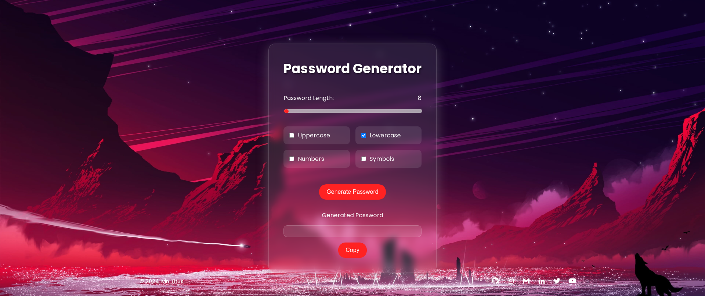

# **Password Generator Documentation**  

<br>

## **Project Overview**  
The **Password Generator** is a user-friendly web application designed to create strong, customizable passwords. It offers users flexibility in setting password length and character types, ensuring robust security.  

#### **Live Demo: [Password Generator by Ivin Titus](https://password-generator-ivin.vercel.app/)**

<br>

## **Features** 
- **Customizable Password Length**: Choose a length between 8 and 52 characters.  
- **Character Options**:  
  - Uppercase letters  
  - Lowercase letters  
  - Numbers  
  - Symbols  
- **Password Copying**: Easily copy generated passwords to your clipboard.  
- **Responsive Design**: Optimized for mobile and desktop viewing.  
- **Elegant UI**: Gradient backgrounds, smooth transitions, and visually appealing controls.

<br>

## **Preview**  
Here’s a preview of the Password Generator:  

  
**&copy; 2024 Ivin Titus**

<br>

## **Installation and Usage**  

### Requirements  
- A web browser (modern versions of Chrome, Firefox, Edge, etc.).  

### Local Setup  
1. Clone this repository:  
   ```bash  
   git clone https://github.com/ivin-titus/password-generator.git  
   ```  
2. Navigate to the project directory:  
   ```bash  
   cd password-generator  
   ```  
3. Open the `index.html` file in your browser.  

<br>

## **How It Works**  

1. **Set the Password Length**: Use the slider to specify your desired length.  
2. **Select Character Options**: Check or uncheck the character type options.  
3. **Generate Password**: Click the *Generate Password* button.  
4. **Copy Password**: Click the *Copy* button to copy the generated password to your clipboard.  

<br>

## **Code Highlights**

### Password Generation Logic  
The function `generatePassword()` dynamically builds a character set based on user input and generates a random password:  
```javascript  
function generatePassword() {  
    var charset = "";  
    if (uppercase) charset += "ABCDEFGHIJKLMNOPQRSTUVWXYZ";  
    if (lowercase) charset += "abcdefghijklmnopqrstuvwxyz";  
    if (numbers) charset += "0123456789";  
    if (symbols) charset += "!@#$%^&*()_+~`|}{[]:;?><,./-=";  

    var password = "";  
    for (var i = 0; i < length; i++) {  
        password += charset.charAt(Math.floor(Math.random() * charset.length));  
    }  
    document.getElementById("password").value = password;  
}  
```  

### Dynamic Length Display  
The password length is updated in real-time:  
```javascript  
document.getElementById("length").addEventListener("input", function() {  
    document.getElementById("length-value").textContent = this.value;  
});  
```  

<br>

## **Credits**  
- Icons: [Boxicons](https://boxicons.com/)  
- Background Image: Custom design  

If reusing the code, kindly provide proper credits:  
```
Password Generator © 2024 Ivin Titus.  
GitHub: https://github.com/ivin-titus  
```  

<br>

## **License** 
This project is © 2024 Ivin Titus. Unauthorized redistribution without credits is prohibited.  
**&copy; 2024 Ivin Titus** 